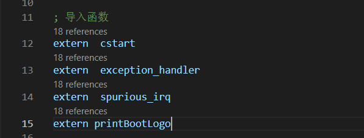
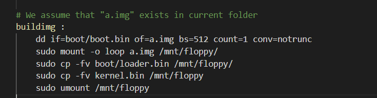

# 在屏幕上画出一个你喜欢的ASCII图案

在kernel/start.c编写函数 

在kernel/kernel.asm中extern声明 printBootLogo函数，并调用 

 

实验效果 

# 中断代码集成
修改代码，使kernel进入死循环（防止hlt被唤醒后继续执行后面的指令，导致出现错误） 

修改hwint01函数 

实验效果 键盘随便输入发现这里的颜色发生了改变 

# 内存管理功能代码
创建mm文件夹，将前面内存管理的函数放入该文件夹的pageManage.asm文件中,将第三章的内存管理功能代码复制过来，但注意要修改一些东西。

注意这里的global和data段中的其他数据，这里就不需要还用段描述符那些东西了 

然后之前的这些步骤也不需要 

 

在kernel/kernel.asm中添加测试函数并调用，被测试函数用extern声明 

 

修改Makefile，在OBJS中添加mm/pageManage.o，在文件末尾添加对该文件的汇编命令。

 

然后magic_break，可以通过info tab清楚地看到alloc_pages和free_pages都被正确地执行

# make时遇到的问题
出现__stack_chk_fail 

在makefile中的CFLAGS后加上-fno-stack-protector参数即可解决

出现is incompatible with i386:x86-64 output 
需要在Makefile的CFLAGS后面添加-m32，LDFLAGS后面添加-m elf_i386 

但是还是会报错，用如下方式解决,最终发现原因是因为没有清除之前make的东西，make clean后再make即可 
最后还有个问题就是虽然makefile中有这些步骤，但是看命令行的回显这些好像没有执行，自己是手动执行的，不然boot/loader.bin，kernel.bin都没有copy到a.img中，修改的内容就没有copy到a.img就不会有效果

