# 修改部分
实验实现了5个进程的调度，调度算法是多级反馈队列调度算法

## include/proc.h

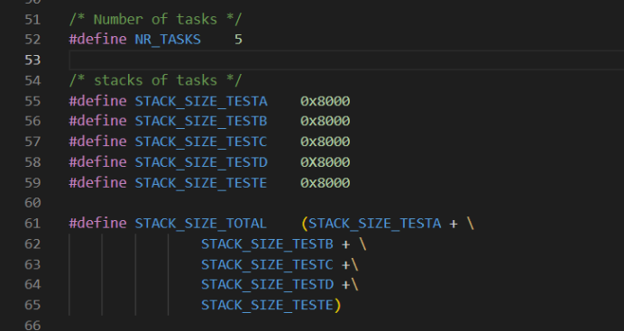

## include/proto.h

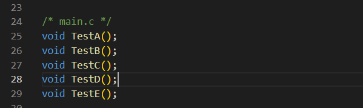

## kernel/main.c
定义TestD,TestE函数

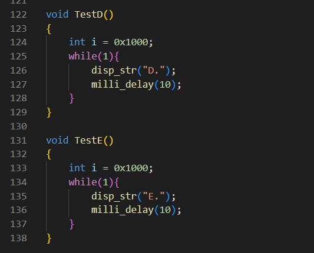

## kernel/global.c
和TestA、B、C一样，把D,E添加到task_table中

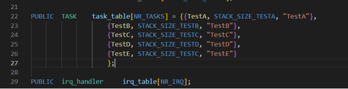

## include/proc.h
高优先级5个tick,中优先级10个tick,低优先级15个tick

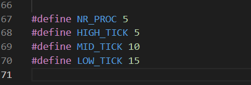

## kernel/global.c
这里定义highP、midP、lowP三个队列，以及highI、midI、lowI三个变量，便于管理多级反馈队列调度算法

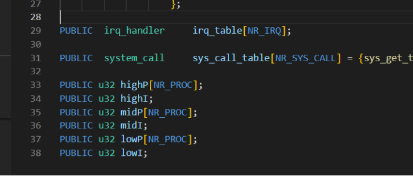

## include/global.h
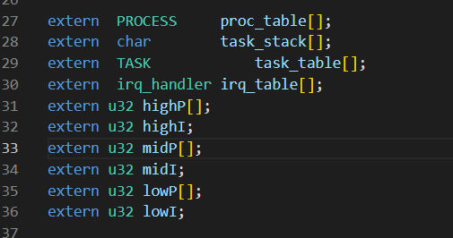

## kernel/main.c
对三个优先级队列进行初始化

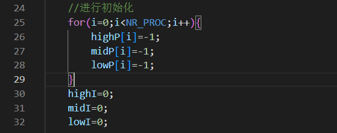

给每个进程分配初始的时间片，这里默认都是5，也就是HIGH_TICK，可以理解为让这5个进程都在高优先级队列中进行排队

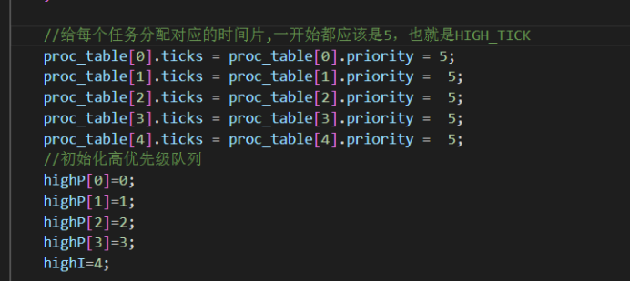

## kernel/clock.c
让E进程在ticks=10时再进入最高级队列，这里选择的是插入队列尾部，插入到队列头部也可以。反正这个调度算法是自己设计，想怎么调度都可以

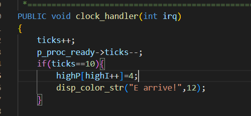

## kernel/proc.c
这个是本次动手改的核心，但其实逻辑并不复杂，主要就是遍历3个队列，寻找队列中的进程是否还有剩余的时间片，如果有就把处理器交给它，否则就让它进入到下一个优先级更低的队列，然后分配时间片。

同时可以看到高优先级、中优先级处理基本都差不多的，这里如果已经在低优先级队列，但是时间片还是用完了，我直接再给它分配一个LOW_TICK。

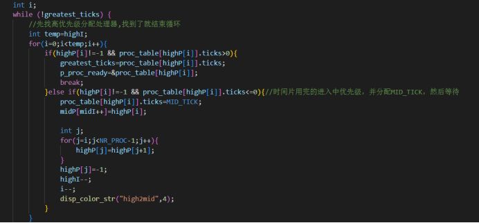 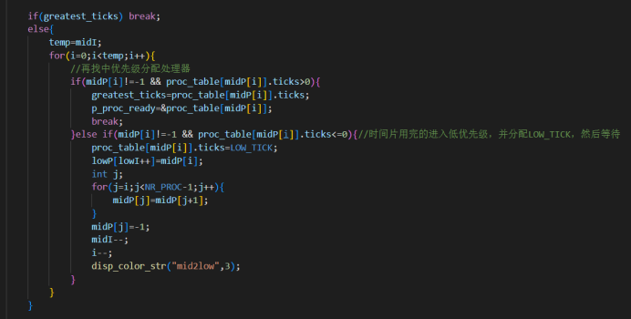 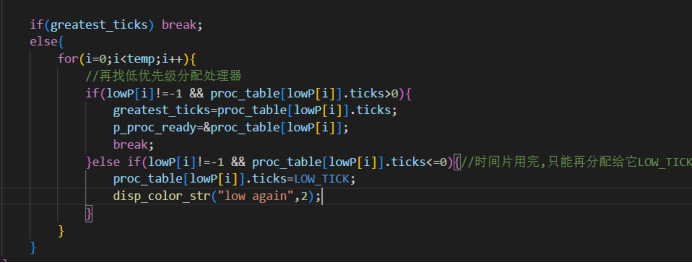

# 最终效果
可以看到我写的调度算法正确地被执行 

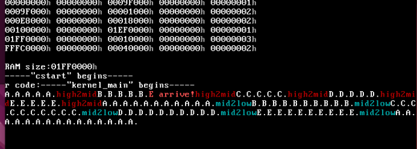