[TOC]
Task:自定义添加1个GDT代码段、1个LDT代码段，GDT段内要对一个内存数据结构写入一段字符串，然后LDT段内代码段功能为读取并打印该GDT的内容

## 代码流程
在阅读了电子书后理解了实模式保护模式相关内容后，想要修改代码，首先应当先摸清楚代码的逻辑，这样才能更好进行修改，以下部分就是代码流程相关分析。此次代码是在pmtest3.asm基础上改的，因此分析这段汇编代码相关流程

* 大体流程
LABEL_BEGIN->LABEL_SEG_CODE32->LABEL_CODE_A(LDT)->LABEL_SEG_CODE16->LABEL_REAL_ENTRY

* LABEL_BEGIN
大体流程是做一些初始化的操作，最后跳转进入LABEL_SEG_CODE32

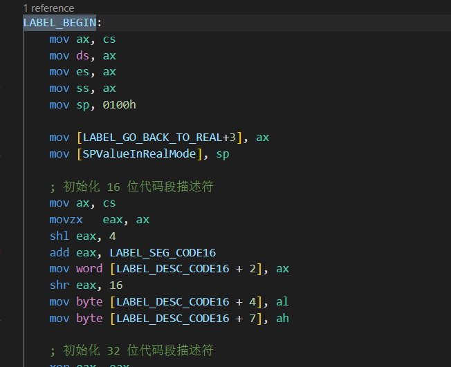 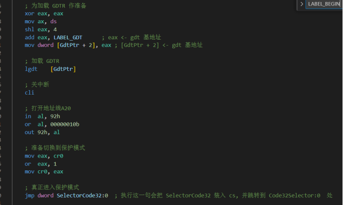

* LABEL_SEG_CODE32
也是先做初始化相关操作（这部分是GDT代码段），然后进入LABEL_CODE_A

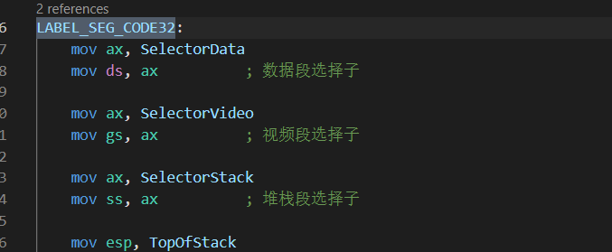 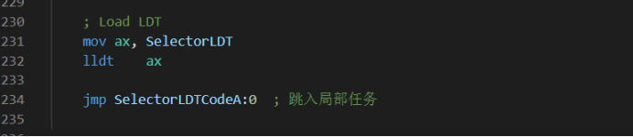

* LABEL_CODE_A
LDT代码段，主要是往显存写入内容，也就是打印数据，最后跳转到LABEL_SEG_CODE16回到执行16位代码

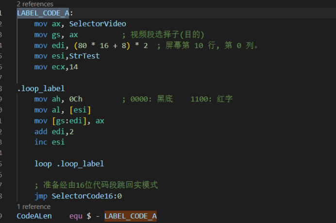

* LABEL_SEG_CODE16
给寄存器赋值，然后跳回实模式

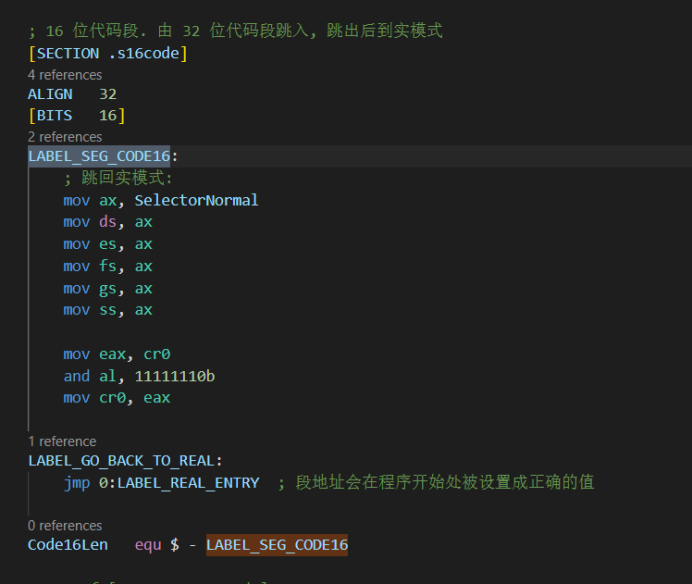

* LABEL_REAL_ENTRY
实模式回到DOS

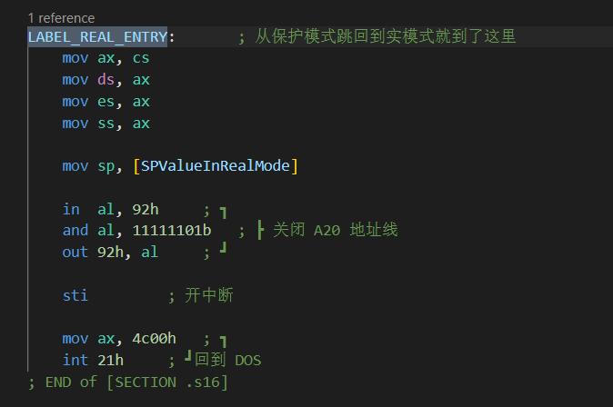

至此我们就搞清楚了整个汇编代码大体是怎么执行的，而根据实验要求，我们要做的就是对GDT代码段、LDT代码段进行修改

## 修改部分
**代码在code1文件夹中**
具体修改内容如下：
* GDT段内要对一个内存数据结构写入一段字符串

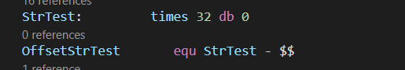 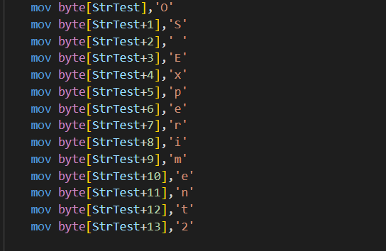

* LDT段内代码段功能为读取并打印该GDT的内容，其实就是往显存里面写东西

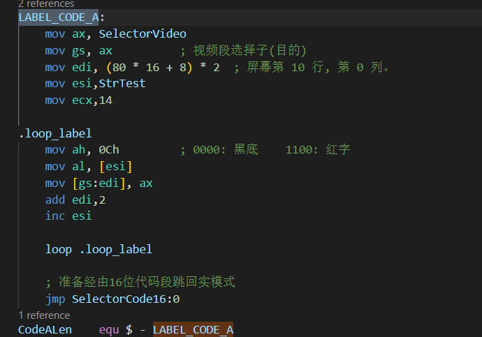

## 实验效果
.com文件可以在DOS环境下运行，这里就不想像项目里面一样在bochs里面启动一个DOS再跑.com文件，而是直接就在DOSBOX里面跑

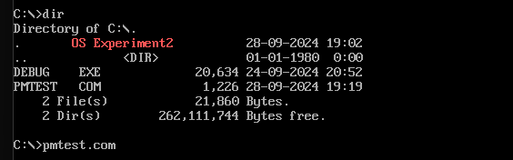

## 心得体会
一开始动手改代码很难下手，因为还要详细地阅读项目里面的相关内容，以及自主学习电子书里面的内容才明白实模式和保护模式相关内容，但这只是改代码第一步。

与计组实验一样，我采用了先通读相关源代码再对其进行修改的方法，这种方法无疑是有效的，只有先对一个项目有整体把握，才能更好的修改代码。在阅读相关代码后，我认识到其实实验目的就是修改LABEL_SEG_CODE32（GDT代码段）和LABEL_CODE_A（LDT代码段），在这个基础上以及一些汇编基础，很快地就完成了代码的修改
