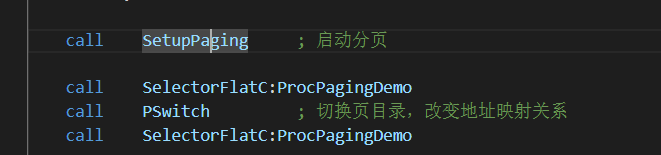

[TOC]
Task:完善分页管理功能，补充alloc_pages, free_pages两个函数功能，试试你能一次分配的最大空间有多大，如果超出了有什么办法解决呢？

## 代码流程
还是先分析代码的整体流程
LABEL_BEGIN->LABEL_SEG_CODE32->LABEL_SEG_CODE16->LABEL_REAL_ENTRY->回到DOS

* 但此次实验重点关注的应该是LABEL_BEGIN，LABEL_SEG_CODE32这两个部分

* **LABEL_BEGIN：**
这里主要是调用int 15h这个中断获取当前系统内存布局，并且存到_MemChkBuf中，LABEL_BEGIN其他部分不需要过多关注

 

* **LABEL_SEG_CODE32：**

DispMemSize：
与LABEL_BEGIN中int 15h相呼应，主要是把_MemChkBuf存到ARDStruct
这个结构体中并且打印  

PagingDemo:
这是本次实验的核心部分，将会重点分析
这部分是在保护模式下，把实际的代码复制到ProcFoo （00401000h），ProcBar（00501000h），ProcPagingDemo （00301000h）中
 

这部分是核心部分 

SetupPaging：
就是把页目录表和页表初始化，然后给CR3赋值为PageDirBase0。但是要注意，这里初始化用的是PageDirBase0，后面的PSwitch会用到另一个基地址，这和页表的地址映射与切换相关

call  SelectorFlatC:ProcPagingDemo
程序开始时LinearAddrDemo指向ProcFoo并且线性地址和物理地址是对等的，所以 LinearAddrDemo应该等于ProcFoo。而ProcFoo和ProcBar应该是指定的物理地址，所以LinearAddrDemo也应该是指定的物理地址。

PSwitch
可以看到这部分和SetupPaging  非常相似，不同点在于初始化页目录项和页表的时候用的是PageTblBase1。同时程序增加了改变线性地址LinearAddrDemo对应的物理地址的语句

由于LinearAddrDemo和ProcFoo相等，并且函数 SetupPaging建立起来的是对等的映射关系（线性地址=物理地址），所以第一次对ProcPagingDemo的调用地址映射到ProFoo。然后PSwitch后修改了LinearAddrDemo，指向Procbar。

至此分析就结束了，但是发现上面的分析大部分还是和切换页面的相关内容相关，虽然和alloc_pages和free_pages没有太多关系，但能加深对OS中页面机制的一些理解。下面开始完善分页管理功能，补充alloc_pages, free_pages两个函数功能。

## 修改部分
**代码在code2文件夹中**

* **alloc_pages部分：**

基于h部分的代码pmtest8.asm进行补充
首先定义Bitmap方便管理物理页面分配，这里假设0x100000以下的页面都不可分配

 

alloc_a_page函数,这个部分主要是辅助alloc_pages函数，通过BitMap找到第一个bitmap值为0的地方，那么这个地方就是可以分配物理地址的地方，返回值存到eax，也就是可以分配的物理页面地址 

alloc_pages函数

AvaLinearAddress就是对应的虚拟地址，这里可以类比为C语言中mmap这种系统调用分配出来的地址，它对应着一些的物理页面。主要过程就是先处理pde,再处理pte,最后把分配的物理地址写入对应的页表中。

这里有个change_pte的循环，ecx注意在我们的测试中一开始就把准备分配的页面给eax，然后mov ecx,eax，也就是ecx的值正好是要分配的页面数，要分配几个页面就会循环几次，调用几次alloc_a_page

* **free_pages部分:**

free_a_page函数，辅助free_pages函数，类似alloc_a_page函数，但注意对bitmap的用法不同，这里是利用bitmap先找到第一个为0的地方，但是我们是要free_pages，所以要从这个位置往回一个个free_pages。**特别要注意btr这个指令，这是我们可以往回一个个free_pages的关键。**

free_pages函数
这个部分类似alloc_pages，但是注意对AvaLinearAddress处理不同，在alloc_pages之后AvaLinearAddress已经更新，我们要找到已经被用的起始地址，所以处理有些许不同，具体看代码以看就懂了

 

* 至此代码补充代码部分就结束了，自己写的这个alloc_pages和free_pages一次分配的最大空间应该只受可分配物理页面的限制，因为具体要分配页面个数一开始就从eax传入，所以只要物理页面还可以分配，eax就可以很大。

## 实验效果
这里先阐述写代码运行的时候遇到的一个问题

看着好像是非法访问，但是这个问题挺棘手的，解决了很久才发现为什么。
其实是因为一开始写的alloc_pages,free_pages不在LABEL_SEG_CODE32内，然后这两个函数就不在正确的代码段内，SegCode32Len计算的值就不对

要知道SegCode32Len是给LABEL_DESC_CODE32:  Descriptor 0, SegCode32Len-1, DA_CR|DA_32  这里赋值用的，如果补充的代码不在这个SegCode32Len计算之前，就会找不到对应的代码，导致非法访问。

 

可以看到alloc四个pages，然后free三个pages都被正确地处理
 

可以看到alloc四个pages，然后free四个pages也被正确地处理
 

## 心得体会
这两部分内容还是比较有挑战性的，一开始我还是通读pmtest8.asm这部分代码，加深了对线性地址，物理地址这些内容的理解，也明白了大体页面分配的逻辑，但是对补充alloc_pages和free_pages这两部分函数其实没太多帮助。

想要补充这两个部分的函数，最重要的是理清楚页面分配的具体过程，搞清楚pde,pte这些概念，因为实际的页面分配中就是对这些进行处理。同时引入BitMap更好的对物理页面进行处理，最后花了很长时间才补充完代码最后可以正常运行。

发现想要用代码实现一个功能或部分，要先扎实理论基础，一开始对这些页面分配概念还比较模糊，根本就无从下手，后来不断去看相关理论，然后对其有了一定的理解，最后才慢慢动手才补全代码

